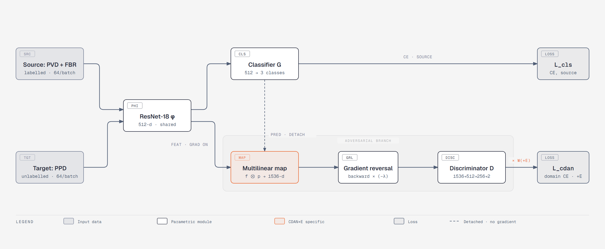
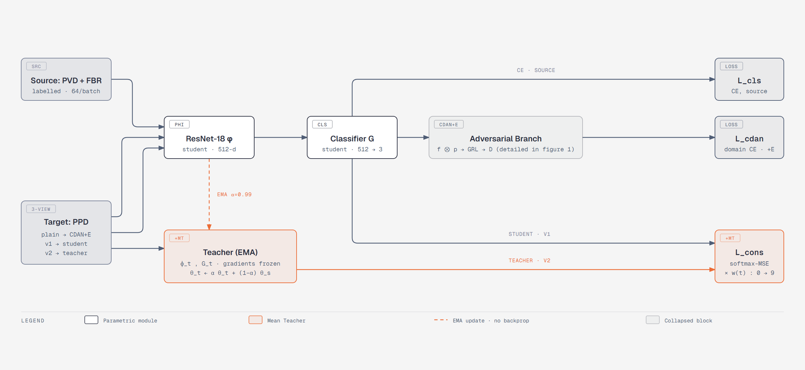

# Plant Disease Diagnosis Across Domains

Unsupervised domain adaptation from lab leaf images to field images, with a controlled comparison of CDAN+E against CDAN+E plus Mean Teacher. A PlantVillage-trained classifier loses most of its accuracy on PlantPathology, and no field labels exist to fix that directly. This repository implements two training methods for that shift, compared under conditions designed so any gap between them comes from a single loss term.


| Arm                   | Objective                        |
| --------------------- | -------------------------------- |
| CDAN+E                | `L_cls + L_cdan`                 |
| CDAN+E + Mean Teacher | `L_cls + L_cdan + w(t) * L_cons` |


## Data


| Split          | Domain     | Images | Labels    | Role                          |
| -------------- | ---------- | ------ | --------- | ----------------------------- |
| PVD train      | Laboratory | 656    | Used      | Supervised classification     |
| PVD val        | Laboratory | 219    | Used      | Model selection only          |
| PPD adaptation | Field      | 1038   | Ignored   | Domain alignment, consistency |
| PPD test       | Field      | 692    | Used once | Final evaluation              |


Three classes: healthy, rust, scab. The source domain is capped at 300 images
per class (rust has only 275). Field rows labelled `multiple_diseases` are
dropped because the source domain has no matching class.

Source images are not used raw. Each is segmented with SAM and composited onto
a patch of a real field image, a step referred to here as FBR
(field-adaptive background recomposition). Background patches are drawn only
from the adaptation split, so no test-set imagery reaches training.

## Pipeline 1: CDAN+E



Source and target images pass through one shared ResNet-18. The classification
head produces `L_cls` on labelled source images. The adversarial branch
conditions features on predictions through a multilinear map `f ⊗ p`, reverses
the gradient, and asks a discriminator to tell the domains apart. The `+E` term 
weights each sample by `1 + exp(-H(p))`, so confident predictions dominate the
domain loss.

## Pipeline 2: CDAN+E plus Mean Teacher



Each target image now yields three views. The un-augmented view feeds the 
adversarial branch exactly as before; two independently augmented views feed
the student and a teacher. The teacher is an exponential moving average of 
the student, receives no gradient, and the disagreement between the two predictions
becomes `L_cons`, a softmax MSE weighted by `w(t)`.

- The EMA update walks parameters only and never touches BatchNorm buffers.
The teacher's buffers stay current because the teacher is kept in `.train()`
mode and its own forward passes update them. ResNet-18 has 20 BatchNorm
layers; leaving the teacher in `.eval()` makes it useless.
- The teacher is frozen at construction and its logits are additionally
computed under `no_grad`.
- Model selection reads the teacher, not the student. The teacher is the
product of the method; selecting on the student discards most of it.

## Experimental Results

Seed 42, 300 epochs per pipeline.


| Method                                   | Field test accuracy | Change            |
| ---------------------------------------- | ------------------- | ----------------- |
| CDAN+E                                   | 89.74%              |                   |
| CDAN+E + Mean Teacher                    | 95.81%              | +6.07 over CDAN+E |

## Repository layout

```
plantuda/
  config.py            Dataclasses describing a run: paths, data, training, Mean Teacher
  seeding.py           Seeding, the shared DataLoader generator, per-epoch re-seeding
  data/
    transforms.py      Stochastic train transform, deterministic evaluation transform
    datasets.py        PlantDiseaseDataset, TargetThreeViewDataset
    splits.py          Domain loading, stratified and seeded splits, FBR cache listing
    loaders.py         DataLoader construction and the Loaders bundle
  fbr/
    segment.py         SAM loading, leaf segmentation, mask refinement
    compose.py         Background patch sampling and alpha compositing
    cache.py           One composite per source image, written once and reused
  models/
    networks.py        ResNet-18 feature extractor, classifier, conditional discriminator
    grl.py             Gradient reversal and its lambda schedule
    cdan.py            Multilinear map and the entropy weight
    mean_teacher.py    Ramp, consistency loss, teacher construction, EMA update
  engine/
    train.py           The loop shared by both arms
    checkpoint.py      Resumable checkpoints, including teacher BatchNorm buffers
    evaluate.py        Test-set accuracy
scripts/
  prepare_data.py      Download both datasets
  build_fbr_cache.py   Pre-compute the FBR source images
  rng_probe.py         Verify that both arms see the same data stream
  train.py             Train one arm
  compare.py           Print the comparison table from stored results
  export_figures.py    Regenerate the figures from their HTML source
figures/
  pipeline-cdane-vs-mt.html   Source of truth for both diagrams
  pipeline-cdane.[png|svg]    Generated
  pipeline-cdane-mt.[png|svg] Generated
notebooks/
  Plant_Disease_MT_CDANE.ipynb   Original exploratory notebook
tests/
```

## Reproducing

```bash
pip install -r requirements.txt
export UDA_SAVE_DIR=/path/to/workspace     # datasets, caches, checkpoints, results

export KAGGLE_USERNAME=... KAGGLE_KEY=...  # required for PlantPathology
python scripts/prepare_data.py
python scripts/build_fbr_cache.py          # needs a GPU for SAM; resumable

python scripts/rng_probe.py                # verify the pairing before training
python scripts/train.py --arm cdane
python scripts/train.py --arm mt
python scripts/compare.py
```

Each arm writes `<UDA_SAVE_DIR>/results/<arm>_s<seed>.json` and skips itself if
that file exists; pass `--force` to re-run. Checkpoints are written every ten
epochs and resumed automatically, so an interrupted session can be restarted
with the same command. A full run is 300 epochs per arm.

For a fast end-to-end check, shorten every schedule so the consistency term is
actually exercised:

```bash
python scripts/train.py --arm mt --epochs 4 --min-select 3 \
    --cons-start 1 --cons-ramp-len 2 --log-every 1 --force
```

## Figures

`figures/pipeline-cdane-vs-mt.html` is the single source for both diagrams. It
is a self-contained HTML file: open it in a browser to view, edit the inline
SVG to change a label or a box, then regenerate the exported files.

```bash
python scripts/export_figures.py           # writes .svg and 2x .png for each diagram
python scripts/export_figures.py --scale 3 # print resolution
```

The README references the generated PNG files by path, so a regenerated figure
appears here with no edit to this document. PNG is used for display because it
carries the intended typography everywhere; the SVG files are for LaTeX and
vector editing. PNG export drives Playwright when installed and otherwise a
local Chrome or Chromium in headless mode.

## Notes

Datasets, checkpoints and caches live under `UDA_SAVE_DIR` and are never
committed. The Kaggle credentials for the PlantPathology download are read from
the environment; if a token was ever pasted into a notebook cell, rotate it and
treat the old one as public.

## References

- Long et al. Conditional Adversarial Domain Adaptation. NeurIPS 2018.
- Ganin and Lempitsky. Unsupervised Domain Adaptation by Backpropagation. ICML 2015.
- Tarvainen and Valpola. Mean teachers are better role models. NIPS 2017.
- Laine and Aila. Temporal Ensembling for Semi-Supervised Learning. ICLR 2017.
- Kirillov et al. Segment Anything. ICCV 2023.

